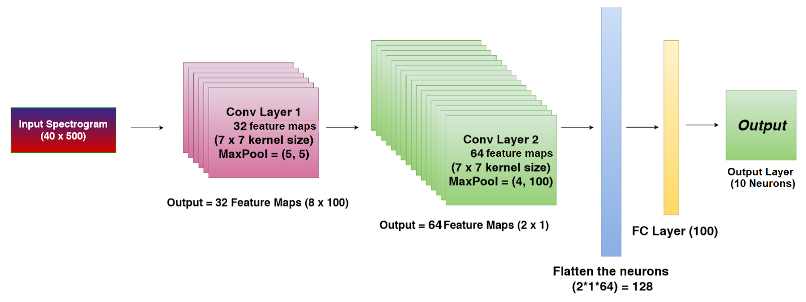

# CS4347 Acoustic Scene Classification

This project is referenced from [CS4347_ASC_BaselineModel](https://github.com/ssrp/CS4347_ASC_GroupProject). The goal of acoustic scene classification is to classify a test recording into one of the provided predefined classes that characterizes the environment in which it was recorded.

## Dataset

You can access the training dataset on [this Google Drive Link](https://drive.google.com/drive/u/1/folders/1HaMgbk2Heszdj71b_6H20-J01Xh8M3u8). It is already divided into train and test sets. You can start downloading the dataset as it is about 10GB+.

The dataset for this project is the TUT Urban Acoustic Scenes 2018 dataset, consisting of recordings from various acoustic scenes. The dataset was recorded in six large european cities, in different locations for each scene class. For each recording location there are 5-6 minutes of audio. The original recordings were split into segments with a length of 10 seconds that are provided in individual files. Available information about the recordings include the following: acoustic scene class (label).

### Acoustic Scenes / Labels
Acoustic scenes for the task (10):

- Airport - airport
- Indoor shopping mall - shopping_mall
- Metro station - metro_station
- Pedestrian street - street_pedestrian
- Public square - public_square
- Street with medium level of traffic - street_traffic
- Travelling by a tram - tram
- Travelling by a bus - bus
- Travelling by an underground metro - metro
- Urban park - park

## GPU Access
Once you download the dataset, you would need to set up your GPU Access. Please let us know if you need help with the GPU access (SoC NUS provides Sunfire cluster for this).

## Baseline Model

The baseline system provides a simple entry-level state-of-the-art approach that gives reasonable results. The baseline system is built on librosa toolbox written in PyTorch.

Students are strongly encouraged to build their own systems by extending the provided baseline system. The system has all needed functionality for the dataset handling, acoustic feature storing and accessing, acoustic model training and storing, and evaluation. The modular structure of the system enables participants to modify the system to their needs. The baseline system is a good starting point especially for the entry level students interested in Deep Learning using PyTorch to familiarize themselves with the acoustic scene classification problem.

### Model Structure

The baseline system implements a convolutional neural network (CNN) based approach, where log mel-band energies are first extracted for each 10-second signal, and a network consisting of two CNN layers and one fully connected layer is trained to assign scene labels to the audio signals. Given below is the model structure:

#### Parameters
- Acoustic features
  - Analysis frame 40 ms (50% hop size)
  - Log mel-band energies (40 bands)
- Network Structure
  - Input shape: 40 * 500 (10 seconds)
  - Architecture:
    - CNN layer #1
      - 2D Convolutional layer (filters: 32, kernel size: 7) + Batch normalization + ReLu activation
      - 2D max pooling (pool size: (5, 5)) + Dropout (rate: 30%)
    - CNN layer #2
      - 2D Convolutional layer (filters: 64, kernel size: 7) + Batch normalization + ReLu activation
      - 2D max pooling (pool size: (4, 100)) + Dropout (rate: 30%)
    - Flatten
    - Dense layer #1
      - Dense layer (units: 100, activation: ReLu )
      - Dropout (rate: 30%)
    - Output layer (activation: softmax)
  - Learning (epochs: 200, batch size: 16, data shuffling between epochs)
    - Optimizer: Adam (learning rate: 0.001)
  - Model selection:
    - Model performance after each epoch is evaluated on the test set, and best performing model is selected.

### Baseline Results
To be announced soon.
